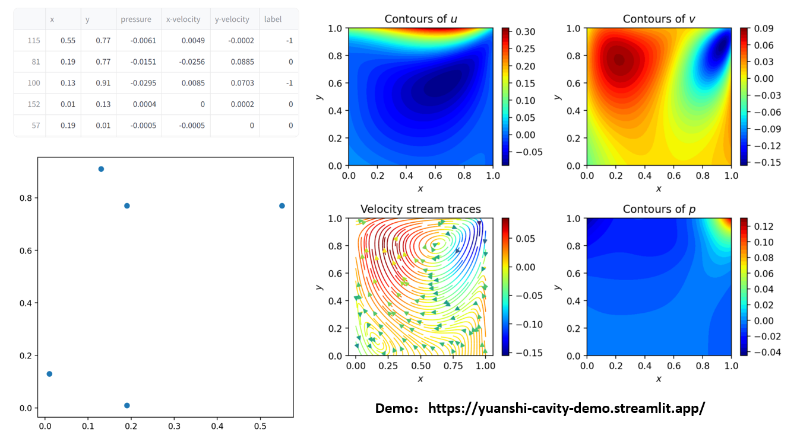

##  PINN 2D Square Cavity
### Introduction
PINN example for 2D square cavity flow in multiple conditions.

### Network Structure

You can train the model by running transformer.py

### Environmental settings

```shell
pip install -r requirements.txt
```
### Deploy Demo
By running main.py, you can get a streamlit deployment demo.\
You can try out the [online demo](https://yuanshi-cavity-demo.streamlit.app/) of streamlit.
The diagram is as follows.


### Contact
If you have any questions, feel free to discuss with me.